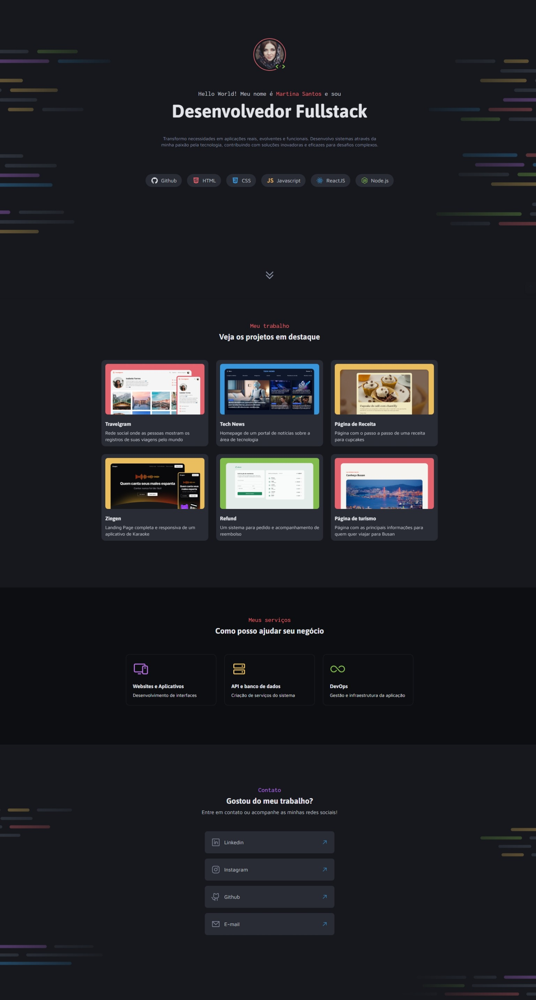
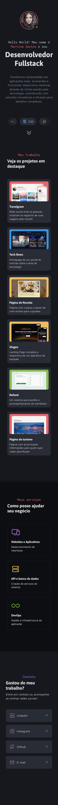

<h1 align="center">PortfolioDev</h1>

  PortfolioDev é um projeto do curso <a href="https://app.rocketseat.com.br/journey/full-stack/overview" target="_blank" rel="noopener noreferrer">Full-Stack da RocketSeat</a> onde construimos um simples portfolio de exemplo.

  
  
  
  
  

 <a href="#objective">Objective</a> •
 <a href="#features">Features</a> • 
 <a href="#instalation">Instalation</a> • 
 <a href="#demonstration">Demonstration</a> • 
 <a href="#technology">Technology</a> • 
 <a href="#autor">Autor</a>

## 🎯 Objective
O objetivo do desafio é construir um simples portfolio utilizando HTML/CSS. Para elevar um pouco o nível desse projeto, eu resolvi acrescentar algumas **Features**, sem fugir do seu escopo original, para torná-lo mais completo e profissional.

## 🔧 Features
- [x] Todo o CSS foi feito com <a href="https://developer.mozilla.org/en-US/docs/Web/CSS/CSS_nesting/Using_CSS_nesting" target="_blank" rel="noopener noreferrer" alt="Link para a documentação sobre CSS Nesting">CSS Nesting</a>
- [x] Responsividade para Celulares de até 320px
- [x] Animação infinita das tecnologias, com CSS**
- [x] Animação nos cards ao fazer scroll da página, com CSS**
- [x] Botão para voltar para o Topo, com JS
- [x] Botão para descer para a segunda sessão do site, com JS

** Essa é uma função experimental(<a href="https://developer.mozilla.org/en-US/docs/Web/CSS/animation-timeline" target="_blank" rel="noopener noreferrer">animation-timeline</a>) do CSS, você pode checar a disponibilidade em navegadores usando o <a href="https://caniuse.com/?search=animation-timeline" target="_blank" rel="noopener noreferrer">CaniUse</a>

## Instalation
- Clone repository:
  - Using CLI: `gh repo clone duhnunes/PortfolioDev`
  - Using GIT: `git clone https://github.com/duhnunes/PortfolioDev.git`
- Open in VSCode:
  - Type `code PortfolioDev`
  - or Go to folder `cd PortfolioDev` and type `code .`
- Open in Browser:
  - Double Click `index.html` file

## 📺 Demonstration
### 1920x1080

### 320px

## ⚒️ Technology
- HTML
- CSS
- JavaScript

## 🧔 Author

  

 
Sou um cara simples que gosta de criar layouts de FrontEnd e estou em constante evolução para me tornar um Dev Fullstack através de boas práticas para ter um código mais organizado, bonito e mais seguro.  

 

